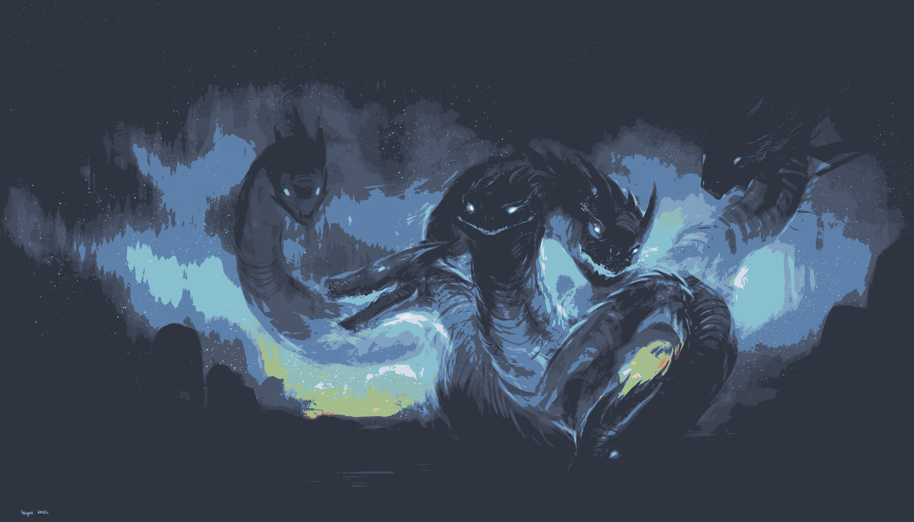

# Image Factory
This is a tool for making images have a particular *palette* of colors. 
Simply give image-factory a palette.txt file full of the desired colors, and it will give you an image containing *only* those colors.

Original (3648x5472)            |  Nord Color Pallete (2.688 seconds)
:-------------------------:|:-------------------------:
  |  

## Usage
There are three mandatory options, one for an input image, one for a `palette.txt` file and one for an output destination.
```bash
image-factory --input wallpaper.jpg --palette palette.txt --output new_wallpaper.jpg
```
Other flags can be seen with the built in help `image-factory --help`.

View the `palette.txt` file in this repo for an example of the [Nord color palette](https://www.nordtheme.com/).


## Install
I'm currently working on packaging it for Nix. I'm happy to help with packaging for other package managers, but only have the knowledge for Nix.

For the time being though, Nix users (with flakes) can run `image-factory` like so:
```bash
nix run github:IllustratedMan-code/Image-Factory -- --help
```
## Building
### Dependencies
- `opencv4`
- `pkg-config`
- `cli11`
- `bear` (optional)
- `ccls` (optional)

### Build
After cloning (or forking) this repo, run `make`. This should create an executable called `image-factory`.

Nix users can just run `nix develop` to get the required dependencies, `nix build` to build, and `nix run` to run.

## Algorithm
How does `image-factory` work? I'm using the simplest euclidean technique outlined [here](https://en.wikipedia.org/wiki/Color_difference).
The closest color in the palette is calculated for each pixel in the target image using the relative distance formula in three dimensions.
The relative weight of each color is defined by scalars `r`, `g`, and `b`.

$$r \cdot R^2 + g \cdot G^2 + b \cdot B^2$$

This is the naive (least efficient and least complex) approach to the [nearest neighbor search](https://en.wikipedia.org/wiki/Nearest_neighbor_search) problem in a coordinate system. 
This shouldn't be a problem for most use cases, but as palettes grow in size, `image-factory` will get slower in a linear fashion.` 

### Potential improvements
All of these improvements will add complexity to the program.
#### Space Partitioning
A space partitioned tree structure might help here, but it won't neccesarily perform better.
#### Greedy method
This method uses a graph data structure to determine distance. It is not 100% accurate, but it may be faster than the current implementation
#### Delauny triangulation
A three dimensional [Delauny triangulation](https://en.wikipedia.org/wiki/Delaunay_triangulation) or more aptly a Delauny tetrahedrization could be used to determine the closest four colors in the palette.
#### OpenGL
An Opengl shader would *probably* outperform all of these algorithms because it takes advantage of the gpu for calculations. Its also a lot harder to implement (at least for me).
#### rust pixels
This is a rust shader library, see example [here](https://github.com/parasyte/pixels/tree/main/examples/custom-shader).
#### cuda support for opencv
It appears that opencv can be compiled wit CUDA support which could make `image-factory` faster

## Alternatives
- [ImageGoNord](https://github.com/Schrodinger-Hat/ImageGoNord)
- [gruvbox-factory](https://github.com/paulopacitti/gruvbox-factory)

ImageGoNord seems to be the only alternative (as far as I know). gruvbox-factory used ImageGoNord behind the scenes. 
It's a much more complicated program with web APIs and other such niceties. The other main feature it has in terms of images is an average filter. 
I hope to implement something similar soon. `image-factory` is much simpler, but I believe the underlying algorithm is similar as output looks very similar.
I believe `image-factory` is faster, but I haven't done detailed testing. 
